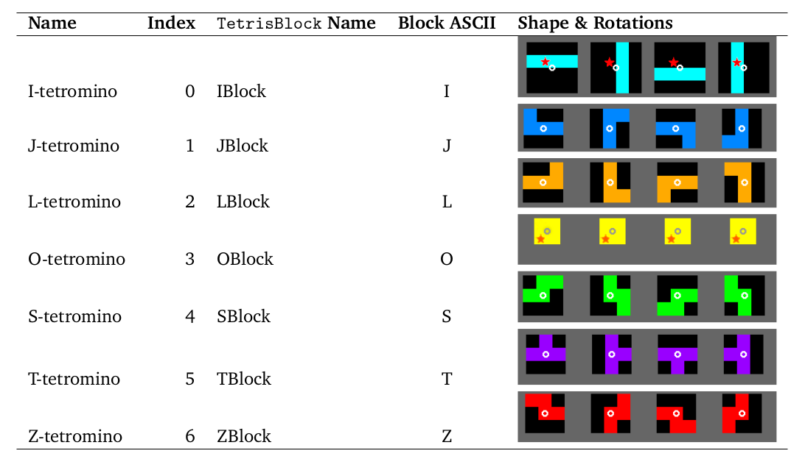

In the second assignment your will implement another classic computer game, namely
Tetris. The game of Tetris centers around **tetrominos**: geometric shapes of 4 orthogonally
connected squares. If you are not familiar with the game, you can play an official web
version [here](https://Tetris.com/play-Tetris)

You are making a slightly simplified version of this game:
* No “ghost” of where the current tetromino will end up.
* No scoring.
* No difficulty curve (speeding up).
* No hold functionality.
* No box showing the next tetrominoes.
* In the official Tetris, if a tetromino is rotated but the target spot is occupied or out
  of bounds, the tetromino may slightly be moved to a space that is free via a “wall-
  kick” system. We do not implement this, we simply do not rotate if the target spot
  is occupied or out of bounds.
  
The assignment is similar to assignments 2.1 and 2.3. Keep your code as simple and
readable as possible. If your implementation is more than 450 lines long (including empty lines), then some-
thing is probably wrong. The reference implementation is 170 lines long.

## Test setup

The test setup is very similar to the Snake test setup. There are two main differences:
* In Snake after each test frame `Step` is called, this is not true for Tetris: only the actions that are listed for the test frame (such as Left,Right,Down,RotateRight ,etc.) are called.
* Some Tetris tests provide an initial configuration of the board.

To ensure reproducible behavior, we specify exactly how a random number generator
must be used to generate random tetrominoes. Similar to snake, a random number
generator is passed to the TetrisLogic class as an argument called randomGen . You should
call randomInt(nrTetrominoes) , where nrTetrominoes=7 , to determine the index of
the tetromino to get.

